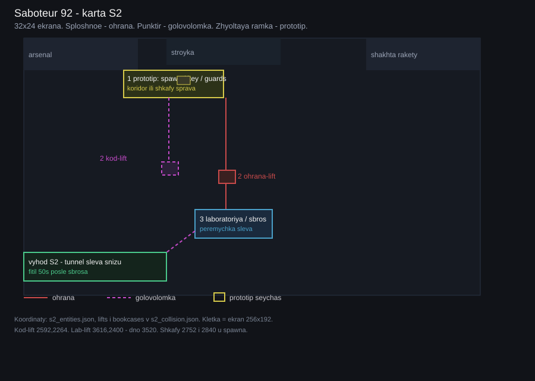
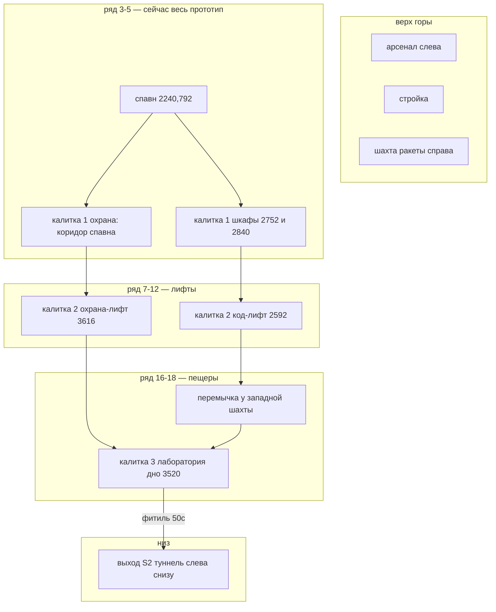

# Saboteur 92 — схема на карте S2



Сетка оригинала: **32 экрана в ширину × 24 в высоту** (мозаика 8192×4608). Картинка: [lab-map.svg](lab-map.svg).

**Сплошное** — путь через охрану. **Пунктир** — обход через головоломку.



## Где что на сетке экранов

Каждая клетка — один Spectrum-экран 256×192. Колонка = x/256, ряд = y/192.

```
колонка     0        8       16       24      31
ряд 0   | арсенал | стройка |        | шахта ракеты |
ряд 4   |         | ## ПРОТОТИП ##   | шкафы восток  |
        |         | спавн ключ охрана жетон пульт    |
ряд 8   |         |          | лифты восток          |
ряд 12  |  код-лифт 10.1     | охрана-лифт 14.1      |
ряд 17  |  перемычка         | ЛАБОРАТОРИЯ           |
ряд 21  |  ТУННЕЛЬ ВЫХОДА =====================      |
```

## Координаты (PNG)

| Что | PNG | Экран col,row |
|---|---|---|
| Спавн | 2240, 792 | 8.8, 4.1 |
| Ключ | 2480, 840 | 9.7, 4.4 |
| Документ | 1920, 696 | 7.5, 3.6 |
| Выход-прототип | 1800, 808 | 7.0, 4.2 — ещё стартовый этаж, не туннель S2 |
| Жетон / пульт-прототип | 3360 / 3480, ~832 | 13, 4 |
| Шкафы калитки 1 | 2752,776 и 2840,776 | 10.8–11.1, 4.0 |
| Код-лифт | 2592, 2264 шахта 960→2264 | 10.1, 11.8 |
| Охрана-лифт в лабу | 3616, 2400 шахта 2280→3520 | 14.1, 12.5 |
| Восточные лифты | 5408 и 5792 | не v1 |

Источник: `assets/world/s2_entities.json`, `lifts` и `bookcases` в `assets/world/s2_collision.json`.
