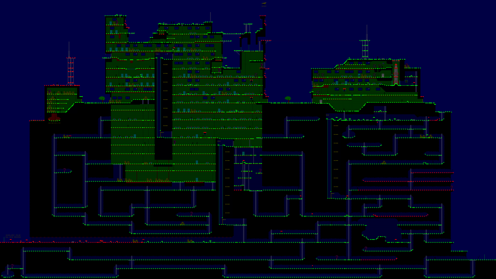

# Maze exploration with Nina (progress)

Goal: take Nina through the whole maze in accelerated mode and reach every
corner, using jumps (somersault), ladders, and lifts. The run is driven live
through the Godot MCP (`run_project` + `run_script`).

## Result of the latest run



Green: visited. Yellow: reachable in the graph but missed by the bot.
Red: not reachable from the start by walking, climbing, jumping, or lifts.

| Metric | Value |
|---|---|
| Standable nav nodes | 4666 |
| Reachable in the graph | 4162 (89.2%) |
| Visited by Nina | 3674 (78.7% of all, 88.3% of reachable) |
| Missed but reachable | 494 |
| Unreachable | 504 |
| Game time | 10328 s (about 2 h 50 min), about 15 min real at ~11× |
| Rescues (teleport after getting stuck) | 426 |
| Moves ok / failed | walk 7358/193, climb 411/28, jump 71/32, drop 83/18, lift 4/2 |

Coverage includes teleport rescues, so it is not a clean playthrough.

There are no ropes in the map. The rope tile has no physics, and its only
cells, on the roof at y 384–392, x 2968–3176, are barrels and bottles.

## How it works

The code for the run:

- `tools/explore/build_nav.py` builds `.mcp/explore/nav_graph.json` from the
  chunk CollisionLayer tiles.
  - Nodes are standable spots on an 8 px grid.
  - Edges: walk, climb (ladders), drop, jump (somersault arcs simulated with
    player physics), and lift.
  - Every shaft floor row gets lift edges to both ends of the shaft.
- `tools/explore/nav_reach.py` computes graph reachability from the start. It
  renders `.mcp/explore/coverage.png` and colours it with
  `explore_report.json`.
- `scripts/demo/explore_demo.gd` is the in-game explorer.
  - Speed: ×12 via physics ticks and `time_scale`, so dt stays 1/60.
  - Guards, sabotage target, and exit are off. Lives are 99. All lift codes
    are known.
  - It uses Dijkstra to the nearest unvisited node, with an executor for each
    edge type.
  - Failed edges are blacklisted after 2 failures, and a target is given up
    after 3 tries.
  - Traps and stuck spots are escaped by teleporting.
  - At the end it writes `.mcp/explore/explore_report.json`.
- To start it:
  - Headless: `godot -- --demo-explore`.
  - Via MCP: add a `MazeExplorer` node with meta `manual` to `Level01`.
  - Progress is available from `coverage()`.

Rebuild and render:

```
python tools/explore/build_nav.py
python tools/explore/nav_reach.py
```

## Game fixes made during the run

- **Lifts would not leave an end stop.**
  - Cause: the cabin uses `sync_to_physics`, so `global_position` reads back
    stale until the next physics step. After the first step down from the top
    stop, `at_top()` still saw the old position, so the lift stopped at once
    and Nina was pushed back up. Going up from the bottom stop failed the same
    way.
  - Fix: `scripts/world/lift.gd` keeps its own `_y` while moving
    (`cabin_y()`).
- **Standing on a cabin flush with the shaft floor was not detected.**
  - Fix: `scripts/player/lift_rider.gd` falls back to `Lift.carries()`, which
    checks the feet against the cabin top, when the only contact is the floor
    tile.
- **Lift cabin start positions**: in `assets/world/s2_collision.json`, each
  cabin was snapped down to the nearest shaft floor row. The locked lift in
  `assets/world/s2_entities.json` changed to match.

  | Shaft x | Old y | New y |
  |---|---|---|
  | 2856 | 960 | 984 |
  | 5672 | 1968 | 1992 |
  | 2856 | 2264 | 2280 (locked lift) |
  | 3880 | 2400 | 2432 |
  | 5672 | 3272 | 3296 |
  | 3880 | 3704 | unchanged (no floor below it until the shaft bottom) |

- Also in this batch: `scripts/levels/level_base.gd` has the `--demo-explore`
  flag.

Verified after the fixes: GUT 111/111, `--demo` (mission complete),
`--demo-fuse` (fuse loss OK), and gdlint clean.

## Map collision fixes

Rule from the user: blue brick (Wallpaper) is open tunnel, black (Earth) is
solid. Judge it on the chunk layers, not on `saboteur2_world2.png` — that old
render still shows the baked guards and panthers that the chunks no longer
have.

- Removed 136 solid cells of baked figures (guards, panthers, the exit pose,
  the motorcycle) that blocked corridors, the bottom tunnel included.
- Removed 29 more solid cells over blue brick and made 61 pure-black free
  cells solid. One black notch at (824, 1992) stays free, because filling it
  would block the corridor under it.
- Graph reachability after the fixes: 4374 of 4562 nodes (95.9%).
- About 70 tunnel ladders end at the rock ceiling. The original data does the
  same, so they stay dead ends on purpose.
- Removed the `shelf_east` passage from `s2_entities.json`. It was a
  hand-authored crouch-teleport (2780,616 → 2976,664) that dropped Nina into
  a spot with no floor; shelves/crates carry no collision, so they are pure
  decoration. The original's "bookcase passage" is the concealed ladder into
  the red INVINCIBILITY room near (900, 1960); that room is already reachable
  by its ladder.
- Replaced the decorative chest in that red room with a real pickup: item
  type `invuln` at (936, 1980) in `s2_entities.json`. Its icon is
  `assets/sprites/bonus_chest.png` (built from the old chest tiles), and
  collecting it calls `Player.grant_invincibility()` for
  `invuln_bonus_time` seconds (default 20). The 9 chest Interior1 cells were
  erased and the wall behind them filled with red-brick veneer `(3,0)`.

## Map problems found (not fixed)

- **Unreachable areas**, shown red on the map:
  - the lower-right floors, about x 6000–7500 at y 2840–3120 and 3520;
  - the left antenna;
  - the right radio tower;
  - the far-left bottom tunnel.
- **Shaft x3880**: the top stop (1344) has no floor next to it. Its second
  cabin (3704) hangs with no floor below it until the bottom (4008).

## Largest missed-but-reachable areas

| Segment | Nodes | x range | Floor y |
|---|---|---|---|
| 8268 | 40 | 5768–6992 | 2712 |
| 9491 | 39 | 4032–4984 | 3144–3152 |
| 11257 | 26 | 6568–7288 | 3720 |
| 12699 | 26 | 392–1144 | 4152 |
| 4614 | 25 | 6032–6736 | 1680–1720 |
| 10250 | 22 | 4192–4768 | 3552–3576 |
| 10472 | 19 | 2928–3448 | 3560–3576 |
| 11529 | 19 | 4664–5240 | 3864 |
| 5203 | 18 | 4744–5272 | 1968–1992 |
| 7550 | 18 | 904–1400 | 2568 |

## Known explorer weaknesses (next steps)

1. **Ladder top landing.** Climb SETTLE accepts arrival while Nina still hangs
   on the ladder a few px below the floor. She then steps sideways and falls
   back down the hatch. This is the most common failure, for example at
   (1416, 3000), (904, 2856), and (1672, 3144). Fix: require `not on_ladder`
   and feet on the floor before ending the climb, and nudge up or sideways to
   dismount.
2. **Somersault arcs.** 32 of 103 jumps landed elsewhere. The takeoff speed
   and position need tuning to match the real physics.
3. **Step-ups above 20 world px.** The graph treats them as walkable, but the
   physics cannot climb them ("wrong floor"). Fix: tighten walk adjacency in
   `build_nav.py`.
4. After those fixes, re-run and compare the coverage. Then decide whether to
   clean the tunnel blobs and fix the passage coordinates.

## Status

Nothing is committed yet. Do not commit `.mcp/` or the local `McpBridge`
autoload line in `project.godot`.
