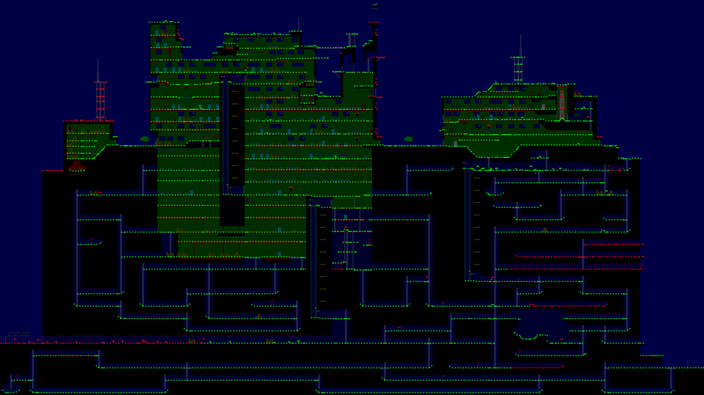

# Maze exploration with Nina (progress)

Goal: take Nina through the whole maze in accelerated mode and reach every
corner, using jumps (somersault), ladders, lifts, and the tightrope. The run
is driven live through the Godot MCP (`run_project` + `run_script`).

CI also runs a graph-only check (`tools/explore/check_reachability.py`) that
does not need Godot: the mission chain must be reachable, the tightrope must
be a reachable rope edge, and every connected blue-tunnel region of the
underground that has walkable floors must contain nodes reachable from spawn.

## Result of the latest graph check (Stage 1–2)

| Metric | Value |
|---|---|
| Standable nav nodes | 4616 |
| Reachable in the graph | 4508 (97.7%) |
| Unreachable | 108 |
| Mission chain | spawn → key → orders → card → console → exit **OK** |
| Blue tunnels with walk floors | all reachable from spawn |
| Tightropes: central complex → radio tower, → left antenna | rope edges reachable |

Earlier bot run (pre-rope, exploratory):

| Metric | Value |
|---|---|
| Standable nav nodes | 4666 |
| Reachable in the graph | 4162 (89.2%) |
| Visited by Nina | 3674 (78.7% of all, 88.3% of reachable) |
| Rescues | 426 |

Coverage PNG from the bot run: 

## How it works

- `tools/explore/build_nav.py` builds a nav graph from CollisionLayer tiles.
  Edges: walk, climb, drop, jump, lift, passage, **rope**.
- `tools/explore/check_reachability.py` — CI entry point (temp dir, not `.mcp/`).
- `tools/explore/nav_reach.py` — optional coverage PNG from a graph / report.
- `scripts/demo/explore_demo.gd` — manual in-game explorer (not a CI gate).

Rebuild:

```
python tools/explore/check_reachability.py
python tools/explore/build_nav.py   # optional: writes .mcp/explore/nav_graph.json
python tools/explore/nav_reach.py
```

## Tightrope (Stage 2)

- Fan map: red dotted line at **y = 672** (cell row 84). Rope cells span
  x 4472–5943, between the central-complex crossbar and the radio-tower
  crossbar (solid/oneway to x ≈ 6103). Row 84 west of x 4472 is rock pillars,
  the column top and the crossbar, and stays solid.
- Way in: the ladder at x ≈ 4281–4294 climbs from the room below (floor
  y 847) to the red ledge; walk right over the column top onto the crossbar
  and run onto the rope. The tower also has its own ladder down to the right
  building's roof (x 6032).
- Second rope, to the left antenna: y = 960 (row 120), x 1240–1695, from the
  crossbar on the central complex's west wall (x ≥ 1696) to the antenna
  crossbar (x 1104–1239, with the antenna ladder at x ≈ 1168).
- `tools/explore/patch_rope_collision.py` paints the ropes from the committed
  chunks; re-run `tools/export_chunks_to_json.py` afterwards.
- Collision atlas x = 4 (`rope`). False rooftop barrel ropes erased.
- Gameplay: `RopeController` — run along the top; stop or reverse → fall.
  Tunables: `Player.rope_speed`, `Player.rope_stop_grace`.

## Map collision notes

Rule: blue brick (Wallpaper) is open tunnel, black (Earth) is solid. Judge on
chunk layers, not on `saboteur2_world2.png`.

Known intentional dead ends: ~70 tunnel ladders that end at rock ceilings
(original data). Left antenna on the far-left building: no invented path —
confirm with the user whether the original reaches it.

Shaft x3880: top stop (1344) has no adjacent floor; a mid cabin can hang with
no floor until the bottom (4008).

## Status

Follow [roadmap_v0.2.md](roadmap_v0.2.md). Do not commit `.mcp/` or the local
`McpBridge` autoload line in `project.godot`.
